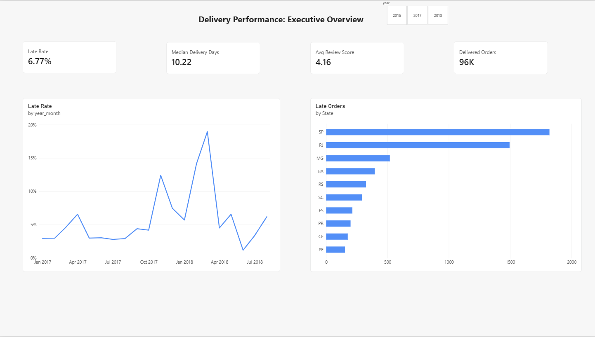
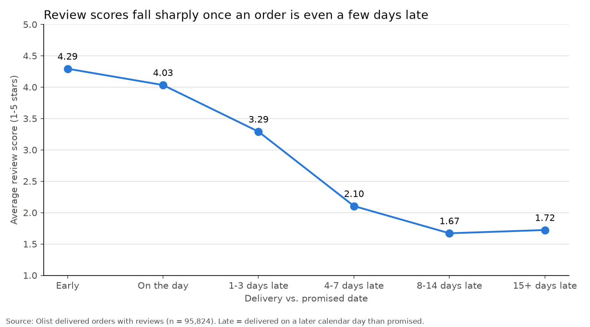

# E-Commerce Fulfillment and Delivery Performance Analysis

An end-to-end analysis of ~99,000 orders from Olist, a Brazilian online marketplace (2016-2018):
from raw CSV files to a validated data model, an Excel workbook, a Power BI report and written
findings for an operations manager.



## Business problem

The operations manager at Olist needs to reduce late deliveries because they are resulting in
negative customer review scores. This analysis will help them decide which states and what factors
are affecting late deliveries so they know where to target improvement.

The 9 analytical questions and every KPI definition are in
[docs/business_questions.md](docs/business_questions.md).

## Key findings

| | Finding |
|---|---|
| **What happened** | 6.8% of delivered orders (6,534 of 96,470) arrived late. 54% of late orders got a 1-star review, compared with 7% of on-time orders. |
| **When** | Lateness was usually 3-5% a month, but spiked in November 2017 (12%) and February-March 2018 (up to 19%). Those two months hold a third of all late orders. |
| **Where** | Rio de Janeiro has the most late orders for its size (1,495; 34% late during the 2018 spike). The northeast has the highest late rates (Alagoas 21%). |
| **Why** | In the 2018 spike, orders that sellers shipped on time still arrived late 15.5% of the time (normally 3.8%), which points to carriers. Separately, 10% of sellers cause 51% of late seller handoffs, all year. |
| **Late is not slow** | Delivery promises are padded by ~12 days on average. States with tighter promises have more late orders (correlation -0.56 across states). |
| **Smaller factors** | Heavier orders are somewhat later (6.5% to 9.4%). Freight cost looked related, but it reflects distance. |



Full write-up, including **what the data does not prove**: [docs/findings.md](docs/findings.md)

## Recommendations

1. **Review the 42 sellers with the most late handoffs** and agree handoff targets
   (list: `outputs/q6_sellers_late_handoff.csv`).
2. **Investigate the February-March 2018 carrier disruption**, especially to Rio de Janeiro, and add a
   monthly late-rate alert.
3. **Recalibrate delivery promises by state**, starting with the northeast (test first).
4. **Treat even a 1-3 day delay as serious**: contact customers proactively when an order will miss its date (test first).

## Approach

| Phase | What was done | Where |
|---|---|---|
| Understand | Inventoried 9 tables, tested primary and foreign keys, drew the relationship map | [data_dictionary.xlsx](data_dictionary.xlsx) |
| Profile | Missing values, duplicates, impossible date sequences, outliers, text formatting | `scripts/01_profile_data.py` |
| Plan | 31 data problems, each with evidence, treatment, business effect and approval | [docs/cleaning_log.md](docs/cleaning_log.md) |
| Clean | Value fixes only; no rows removed (exclusions are flags) | `scripts/02_clean_data.py` |
| Model | Star schema: 4 fact tables, 4 dimension tables, calculated fields and flags | `scripts/03_build_tables.py` |
| Validate | 40 automated checks (row counts, money totals to the cent, keys, recalculation) | [docs/validation_report.md](docs/validation_report.md) |
| Excel | Dashboard, pivot analysis and an Excel-vs-Python check sheet, all live formulas | `scripts/05_build_excel.py` |
| Analyze | The 9 questions answered from the final tables | `scripts/06_answer_questions.py`, `outputs/` |
| Power BI | 5-page report with DAX measures, drill-through and a star-schema model | `powerbi/` |

**Python, Excel and Power BI give the same results.** For example, 96,470 delivered orders, 6,534 late
and a 6.77% late rate in all three tools.

### Data model

Arrows point from **many** to **one**.

```
            dim_customer        dim_date
                  ▲                ▲
                  │                │
fact_payments ─► fact_orders ◄─ fact_reviews
                  ▲      │
                  │      └──► dim_seller
            fact_order_items ─► dim_product
```

Items, payments and reviews each link to orders separately and are never joined to each other, so
order totals can't be multiplied (verified: item prices, freight and payments match the raw data to
the cent).

## Tools

Python 3.13 (pandas, matplotlib, openpyxl), Microsoft Excel, Power BI Desktop (DAX, Power Query).

## How to reproduce

1. Download the [Olist Brazilian E-Commerce dataset](https://www.kaggle.com/datasets/olistbr/brazilian-ecommerce)
   from Kaggle and put its 9 CSV files in `data/raw/`. The data is not included in this repository;
   see the Kaggle page for its license terms.
2. Install the Python packages and run the scripts in order:

```
pip install -r requirements.txt
python scripts/01_profile_data.py      # profile raw data, build data_dictionary.xlsx
python scripts/02_clean_data.py        # apply approved fixes -> data/interim/
python scripts/03_build_tables.py      # facts and dimensions -> data/processed/
python scripts/04_validate_outputs.py  # 40 checks -> docs/validation_report.md
python scripts/05_build_excel.py       # Excel workbook -> excel/
python scripts/06_answer_questions.py  # the 9 questions -> outputs/
```

3. **Power BI:** open `powerbi/olist_fulfillment_dashboard.pbix`. If your folder location differs, update
   the file paths in **Transform data → Data source settings**, then **Refresh**.

## Repository structure

```
README.md                 this page
data_dictionary.xlsx      every table, column and relationship
requirements.txt          Python packages
data/                     raw, interim and processed data (not published; see above)
docs/
  business_questions.md   business problem, 9 questions, KPI and field definitions
  cleaning_log.md         31 data problems and approved treatments
  validation_report.md    40 automated checks, plus Excel and Power BI reconciliation
  findings.md             findings, limitations and recommendations
  project_log.md          dated log of every step and decision
scripts/                  the pipeline (01-06)
outputs/                  result tables for the 9 questions
excel/                    Excel workbook
powerbi/                  Power BI report
images/                   dashboard preview and charts
exploration/              early exploratory scripts (superseded by scripts/, kept as a record)
```

## Limitations

The data shows strong associations, not proof of cause: for example, poor sellers could cause both
late deliveries and low reviews. Carriers are not named, revenue impact is not measured, and orders
still in transit when the data was collected are missing. Details in
[docs/findings.md](docs/findings.md#5-what-does-the-data-not-prove).
